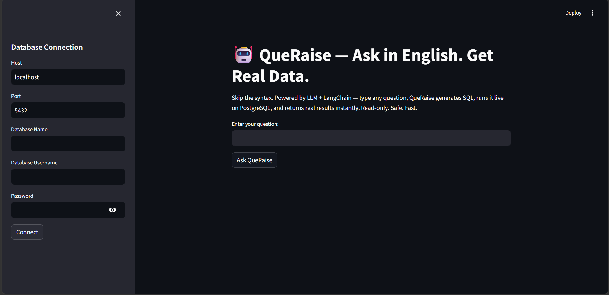
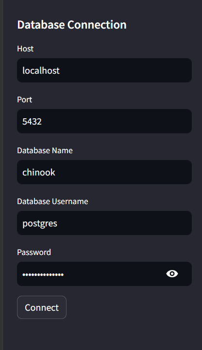
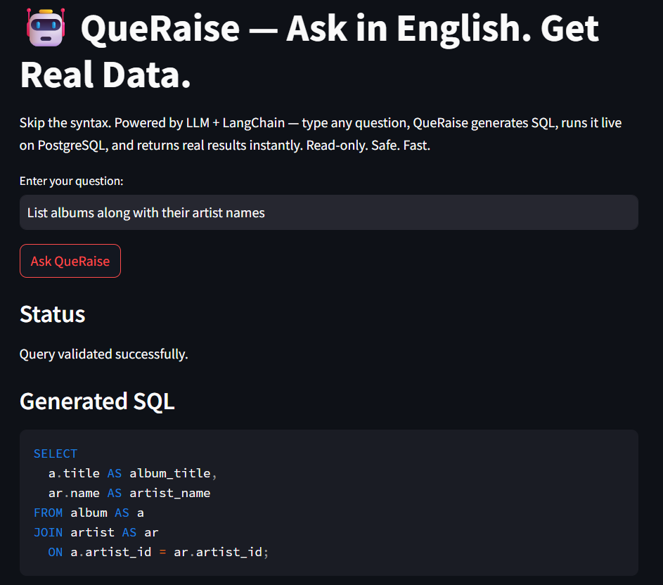
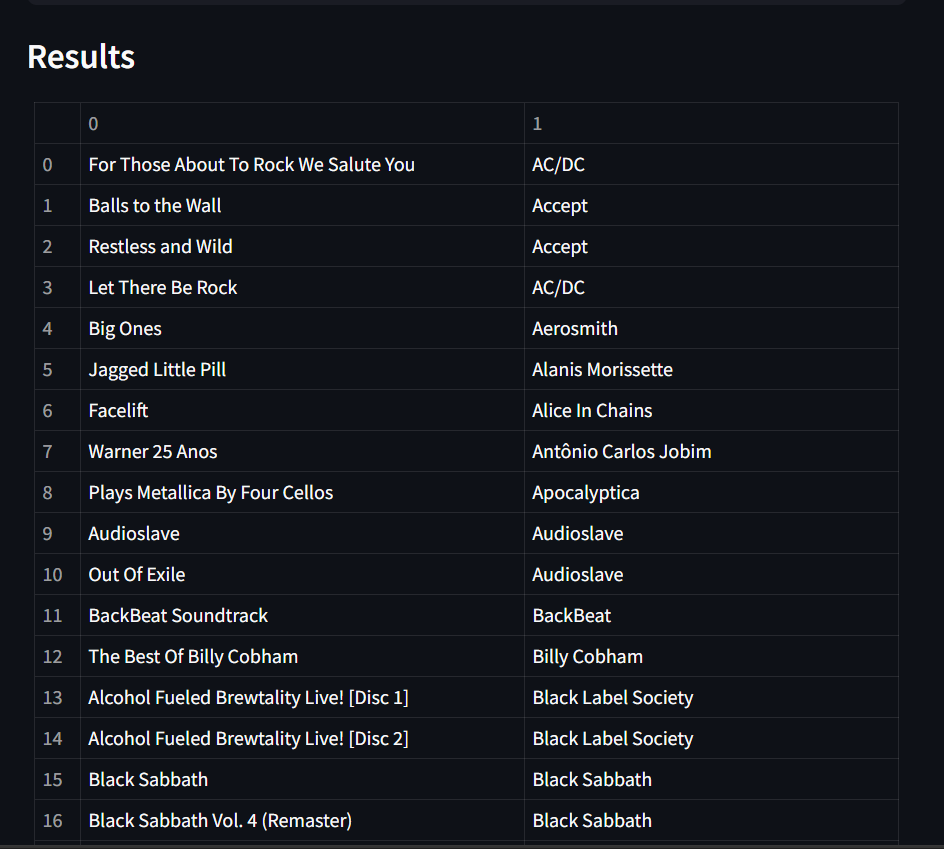

<div align="center">


# 🤖 QueRaise
### *Ask in English. Get Real Data.*

**A schema-agnostic, AI-powered Natural Language → SQL pipeline**
that connects to any PostgreSQL database, reads its structure dynamically,
and returns live query results — no SQL knowledge required.

<br/>

[](https://python.org)
[](https://fastapi.tiangolo.com)
[](https://streamlit.io)
[](https://langchain.com)
[](https://deepmind.google/technologies/gemini/)
[](https://postgresql.org)
[](LICENSE)
[]()

<br/>

> **"Skip the syntax. Connect your database, ask anything in plain English,
> and get live results powered by Google Gemini + LangChain."**

<br/>

[🚀 Quick Start](#-quick-start) · [🏗️ Architecture](#%EF%B8%8F-architecture) · [✨ Features](#-features) · [📦 Installation](#-installation) · [🗺️ Roadmap](#%EF%B8%8F-roadmap)


</div>

---

## 🎯 Why QueRaise?

Most business users cannot write SQL. They know what they want — they just can't express it in database syntax. QueRaise eliminates that barrier entirely.

| Without QueRaise | With QueRaise |
|---|---|
| Learn SQL syntax first | Ask in plain English |
| Know table names and relationships | Schema is auto-discovered |
| Write JOINs, GROUP BYs manually | AI handles all of it |
| Risk writing destructive queries | Read-only execution, always safe |
| Works only on one schema | Connects to **any** PostgreSQL database |

---

## ✨ Features

<table>
<tr>
<td width="50%">

### 🧠 AI SQL Generation
- Natural Language → production-ready SQL
- Schema-aware — AI sees your actual tables
- PostgreSQL-optimised output
- Powered by **Google Gemini 2.5 Flash**

</td>
<td width="50%">

### 🔌 Dynamic PostgreSQL Support
- Connect **any** PostgreSQL database
- Auto-discovers schema at runtime
- No hardcoded tables or columns
- Provide host, port, DB name, credentials

</td>
</tr>
<tr>
<td width="50%">

### ⛓️ LangChain Pipeline
- LangChain + LangChain Core
- LangChain Google GenAI integration
- Multi-step reasoning chain
- Schema context injected automatically

</td>
<td width="50%">

### 🛡️ Validation Layer
- SQL cleaning before execution
- Query validation (no DROP, DELETE, etc.)
- Schema validation against live DB
- Safe read-only execution guaranteed

</td>
</tr>
<tr>
<td width="50%">

### ⚡ FastAPI Backend
- REST API architecture
- `POST /query` — generate + run SQL
- `GET /test-connection` — verify DB
- Pydantic models for type safety

</td>
<td width="50%">

### 🖥️ Streamlit Frontend
- Database connection sidebar
- One-click connection testing
- Natural language input box
- SQL display + live result table

</td>
</tr>
</table>

---

## 🏗️ Architecture

```
┌─────────────────────────────────────────────────────────┐
│                    USER INTERFACE                        │
│              Streamlit Frontend (Port 8501)              │
│    [ DB Sidebar ] [ Question Input ] [ Results Table ]   │
└──────────────────────────┬──────────────────────────────┘
                           │  HTTP POST /query
                           ▼
┌─────────────────────────────────────────────────────────┐
│                   FASTAPI BACKEND                        │
│                     (Port 8000)                          │
│                                                          │
│   routes/ ──► service.py ──► langchain_pipeline.py      │
│                    │                                     │
│             schema_context.py                            │
│             (reads live DB schema)                       │
└───────────┬──────────────────────┬──────────────────────┘
            │                      │
            ▼                      ▼
┌───────────────────┐   ┌──────────────────────────────────┐
│   AI LAYER        │   │        DATA LAYER                │
│                   │   │                                  │
│  LangChain Chain  │   │  PostgreSQL (any local DB)       │
│       ↓           │   │                                  │
│  Gemini 2.5 Flash │   │  • Schema auto-discovered        │
│       ↓           │   │  • Query executed read-only      │
│  SQL Generated    │   │  • Results returned as JSON      │
│       ↓           │   │                                  │
│  Validation Layer │   └──────────────────────────────────┘
└───────────────────┘
```

---

## 🔄 End-to-End Workflow

```
User types English question
         │
         ▼
Streamlit sends POST /query to FastAPI
         │
         ▼
Backend reads PostgreSQL schema dynamically
         │
         ▼
LangChain builds schema-aware prompt
         │
         ▼
Google Gemini 2.5 Flash generates SQL
         │
         ▼
Validation Layer cleans + verifies SQL
         │
         ▼
query_executor.py runs SQL on PostgreSQL
         │
         ▼
Results returned → Streamlit displays table
```

**Example:**
```
Input:   "Show the top 5 customers by total revenue"

SQL:     SELECT c.first_name, c.last_name, SUM(i.total) AS revenue
         FROM customer c
         JOIN invoice i ON c.customer_id = i.customer_id
         GROUP BY c.customer_id
         ORDER BY revenue DESC
         LIMIT 5;

Output:  Live table of 5 rows from your database
```

---

## 🛠️ Tech Stack

| Layer | Technology | Purpose |
|---|---|---|
| **Frontend** | Streamlit | UI, connection sidebar, result display |
| **Backend** | FastAPI | REST API, routing, request handling |
| **AI Model** | Google Gemini 2.5 Flash | SQL generation, schema reasoning |
| **AI Framework** | LangChain | Prompt chaining, schema injection |
| **Database** | PostgreSQL | Any locally hosted PostgreSQL DB |
| **DB Driver** | psycopg2 | Python ↔ PostgreSQL connection |
| **Validation** | Custom Python | SQL safety + schema checks |
| **Config** | python-dotenv | Environment variable management |
| **Types** | Pydantic | Request/response model validation |

---

## 📁 Project Structure

```
QueRaise/
│
├── backend/
│   ├── main.py                  # FastAPI app entry point
│   ├── config.py                # Settings and env vars
│   ├── database.py              # PostgreSQL connection
│   ├── schema_context.py        # Dynamic schema reader
│   ├── langchain_pipeline.py    # LangChain chain setup
│   ├── langchain_sql_generator.py  # SQL generation logic
│   ├── query_executor.py        # Run SQL on live DB
│   ├── service.py               # Business logic layer
│   ├── models.py                # Pydantic request/response
│   └── routes/                  # FastAPI route handlers
│       └── query.py
│
├── frontend/
│   └── streamlit_app.py         # Full Streamlit UI
│
├── prompts/                     # Prompt templates
├── tests/                       # Test scripts
├── data/                        # Sample data / schema SQL
│
├── requirements.txt
├── .env                         # API keys (not committed)
├── .gitignore
└── README.md
```

---

## 📦 Installation

### Prerequisites

- Python 3.11+
- PostgreSQL (any version, running locally)
- Google Gemini API key — [get one free here](https://aistudio.google.com/app/apikey)

### Step 1 — Clone the repository

```bash
git clone https://github.com/Adiitya2328/QueRaise.git
cd QueRaise
```

### Step 2 — Create virtual environment

```bash
python -m venv venv

# Windows
venv\Scripts\activate

# macOS / Linux
source venv/bin/activate
```

### Step 3 — Install dependencies

```bash
pip install -r requirements.txt
```

### Step 4 — Set up environment variables

```bash
cp .env.example .env
```

Edit `.env`:

```env
GEMINI_API_KEY=your_gemini_api_key_here
```

---

## 🔐 Environment Variables

| Variable | Required | Description |
|---|---|---|
| `GEMINI_API_KEY` | ✅ Yes | Google Gemini API key for SQL generation |

> **Note:** PostgreSQL credentials are entered at runtime via the Streamlit sidebar — they are never stored or committed.

---

## 🚀 Quick Start

### 1. Start the FastAPI backend

```bash
cd backend
uvicorn main:app --reload --port 8000
```

Backend runs at: `http://localhost:8000`
API docs at: `http://localhost:8000/docs`

### 2. Start the Streamlit frontend

```bash
# In a new terminal
cd frontend
streamlit run streamlit_app.py
```

Frontend runs at: `http://localhost:8501`

### 3. Connect your database

In the Streamlit sidebar, enter:
- Host (e.g. `localhost`)
- Port (e.g. `5432`)
- Database name
- Username
- Password

Click **Test Connection** → then start asking questions.

---

## 💬 Usage Examples

Once connected, try asking:

```
"Show me the top 5 customers by total spending"
"Which products have never been ordered?"
"List all employees hired after 2020"
"What is the total revenue per month this year?"
"Which country has the most customers?"
```

QueRaise handles all JOINs, GROUP BYs, subqueries, and aggregations automatically.

---

## 🌐 Deployment

| Component | Platform | Notes |
|---|---|---|
| **Backend** | [Render](https://render.com) | Free tier, auto-deploy from GitHub |
| **Frontend** | [Streamlit Community Cloud](https://streamlit.io/cloud) | Free, connect GitHub repo |
| **Database** | User-provided | Any locally hosted PostgreSQL |

### Environment variable on deployment platforms:
```
GEMINI_API_KEY = your_key_here
```

---

## 🗺️ Roadmap

### ✅ Completed
- [x] Dynamic PostgreSQL connection
- [x] Schema auto-discovery
- [x] AI SQL generation via Gemini
- [x] LangChain pipeline
- [x] FastAPI backend
- [x] Streamlit frontend
- [x] Query validation layer
- [x] Read-only safe execution
- [x] Feature branch Git workflow

### 🔄 In Progress
- [ ] Docker + Docker Compose
- [ ] Improved error handling

### 🔮 Future Enhancements
- [ ] Query history (store past questions + results)
- [ ] Data visualisations (auto-charts for numeric results)
- [ ] Query explainer (LLM explains what the SQL does)
- [ ] MySQL + SQL Server support
- [ ] Authentication layer
- [ ] Caching layer for repeated queries
- [ ] CI/CD pipeline

---

## 📸 Screenshots

> *Screenshots coming after deployment*

| Feature | Preview |
|---|---|
| Main UI |  |
| DB Connection Sidebar |  |
| SQL Generation |  |
| Query Results |  |


---

## 💼 Portfolio Highlights

> For recruiters and hiring managers reviewing this project:

**What this project demonstrates:**

- **End-to-end AI system design** — not just an API call, but a full pipeline from UI to database
- **Prompt engineering** — schema-aware prompts that give the LLM the right context to generate accurate SQL
- **LangChain framework proficiency** — chain construction, schema injection, multi-step reasoning
- **FastAPI + REST API design** — clean endpoint design with Pydantic validation
- **Dynamic system architecture** — works on any PostgreSQL database without reconfiguration
- **Production awareness** — validation layer, read-only safety, error handling
- **Professional Git workflow** — feature branches, structured commits, clean history

**Resume line:**
> *"Designed and deployed a schema-agnostic text-to-SQL pipeline using LangChain + Google Gemini 2.5 Flash that dynamically connects to any PostgreSQL database, auto-discovers schema at runtime, and returns live query results from natural language input via a FastAPI + Streamlit interface"*

---

## 🤝 Contributing

Contributions are welcome. Please open an issue first to discuss what you would like to change.

```bash
git checkout -b feature/your-feature-name
git commit -m "add: your feature description"
git push origin feature/your-feature-name
```

Then open a Pull Request.

---

## 📄 License

This project is licensed under the MIT License — see the [LICENSE](LICENSE) file for details.

---

<div align="center">

**Built with 🤖 AI + ☕ effort**

*QueRaise — Natural Language. Live Database Results.*

[](https://github.com/Adiitya2328/QueRaise)

</div>